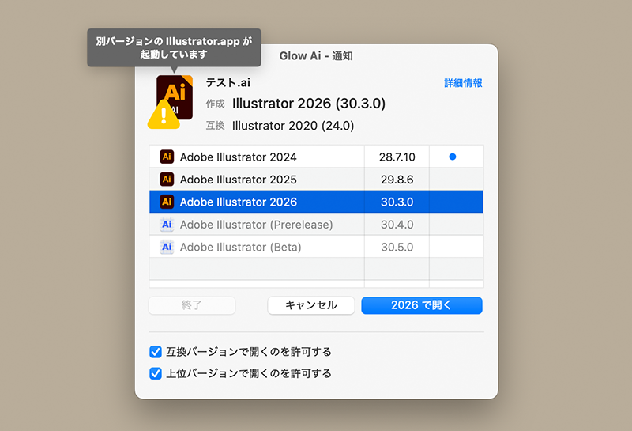

# Glow Ai

macOS用デスクトップアプリ

## 用途

Glow Ai は、Adobe Illustrator ファイル（.ai / .ait / .eps）を、そのファイルが作成されたバージョンの Illustrator で自動的に開くユーティリティアプリです。EPS ファイルが Photoshop で作成されていた場合は、通知ウインドウを表示してどのバージョンの Photoshop で開くかを選択できます。Illustrator編集機能を保持したPDFファイルに対応。

## 使い方

Glow Ai を一度起動すると、.ai / .ait / .eps ファイルが Glow Ai に自動的に関連付けられます。以降はファイルをダブルクリックするだけで Glow Ai が起動し、バージョンを判定して適切な Illustrator で開きます。

1. .ai / .ait / .eps ファイルをダブルクリックします。
2. Glow Ai が起動し、ファイルの作成バージョンを判定します。
3. バージョンが一致する Illustrator が見つかれば自動的に開きます。見つからない場合や、確認が必要な場合は通知ウインドウが表示されます。

詳細は、Glow Ai のヘルプメニュー「Glow Ai ヘルプ」を選択してください。

## トラブルシューティング
起動時に『Glow Aiを「アプリケーション」フォルダへ移動してください』とアラートが出てしまうときの対処方法。

1. Glow Ai をゴミ箱に入れて削除
2. zip を再ダウンロード
3. zip を解凍する（ここで Glow Ai を起動してはいけない）
4. Glow Ai をアプリケーションフォルダへ移動
5. Glow Ai を起動

順番通りに行ってください。**順番が重要**です。

## 動作環境

macOS 13.5 Ventura 以降（Universal Binary）

## ライセンス

This project is licensed under the MIT License - see the [LICENSE](LICENSE) file for details.
